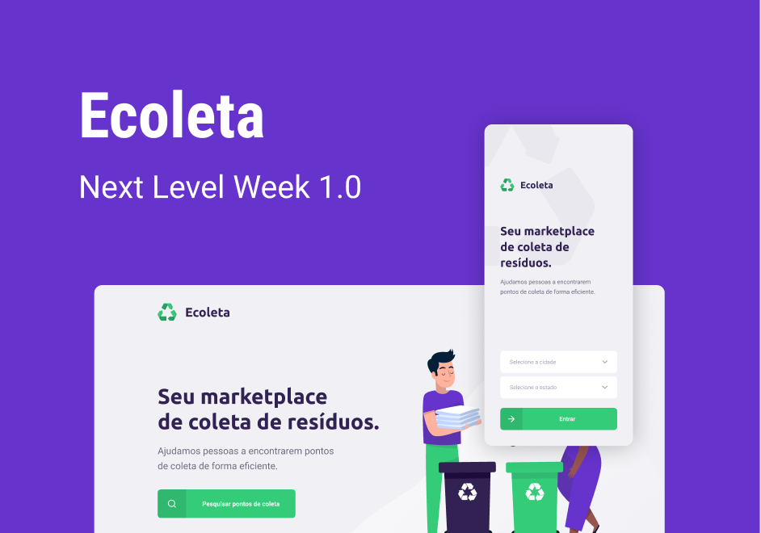

    

## Next Level Week#01 🚀️

### Sobre o Projeto

♻️ Ecoleta é uma aplicação que visa ajudar as pessoas a encontrar locais que coletam tipos específicos de resíduos, incentivando a reciclagem! ♻️

Tecnologias usadas:

-   [Node.js](https://nodejs.org/)
-   [ReactJS](https://reactjs.org/)
-   [React Native](https://facebook.github.io/react-native/)
-   [TypeScript](https://github.com/microsoft/TypeScript)
-   [React Navigation](https://reactnavigation.org/)
-   [React-icons](https://react-icons.netlify.com/)
-   [Axios](https://github.com/axios/axios)
-   [Knex.js](http://knexjs.org/)
-   [SQLite](https://www.sqlite.org/index.html)

    

